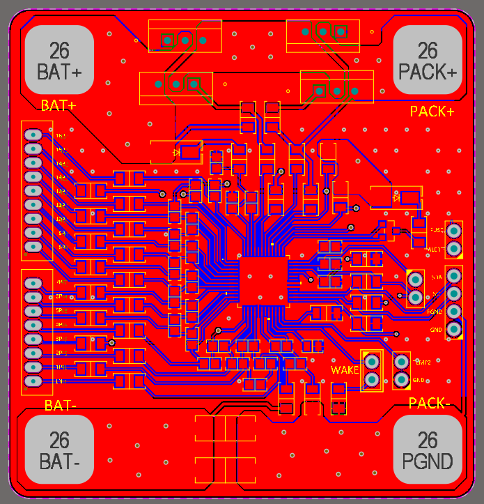
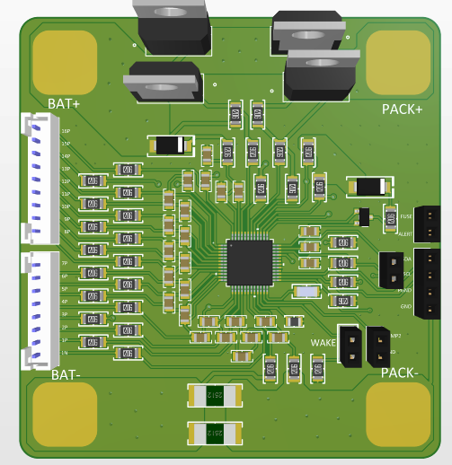
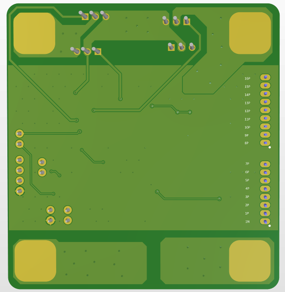

## BQ76952 Battery Monitor Test Board

This test board design is based on resources provided by Texas Instruments for the [BQ76952](https://www.ti.com/product/BQ76952) battery monitor IC.

The PCB is designed with a focus on ease of manual assembly (hand-soldering), considering practical layout and spacing.

> **Note:** The board has not been tested yet. Test results and design feedback will be shared after initial evaluation.

### Board Images

#### Front View

#### Alternative Front View

#### Back View

